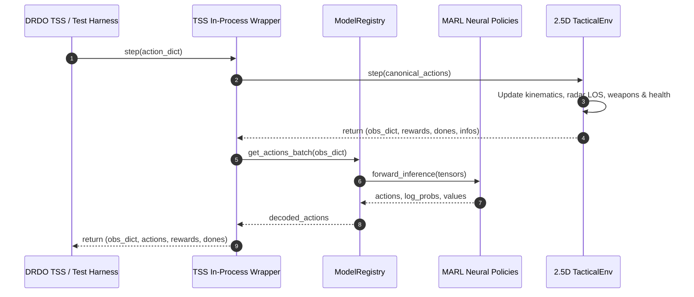

# Tactical MARL System Architecture Document

**Prepared for:** Defence Research & Development Organisation (DRDO), Ministry of Defence, Government of India  
**Coordinating Laboratory:** Aeronautical Development Establishment (ADE), Bengaluru  
**Classification:** Technical Architectural Specification (10-Layer Design)  
**System Version:** `v1.0.0`

---

## 1. System Overview & Architectural Principles

The Tactical Multi-Agent Reinforcement Learning (MARL) System is structured as a decoupled, 10-layer modular architecture designed for high-performance tactical simulation, training, validation, and real-time operational integration.

### Core Architectural Principles
1. **Separation of Concerns:** Each layer operates with strictly bounded responsibilities. Simulator physics do not depend on neural architectures; neural policies do not depend on database or UI implementations.
2. **Deterministic Reproducibility:** Exact bit-identical execution is guaranteed under identical seeds across all layers for forensic analysis, while stochastic exploration is rigorously verified across different seeds.
3. **Sub-Millisecond Operational Latency:** Forward neural inference is engineered to execute in $< 2.0\text{ ms}$, exceeding real-time requirements for military simulation loops (typically $20\text{ Hz}$ to $50\text{ Hz}$).
4. **Standardized External Interfaces:** The system provides native Gymnasium and PettingZoo multi-agent interfaces alongside an asynchronous REST API, allowing plug-and-play integration with DRDO's Tactical Scenario Simulator (TSS).

---

## 2. Global Architecture Diagram

```
+===================================================================================================+
|                                    DRDO TSS SIMULATION RUNTIME                                    |
+===================================================================================================+
         |                                                                        ^
         | Simulation State Telemetry                                             | Control Actions
         v                                                                        |
+---------------------------------------------------------------------------------------------------+
| LAYER 8: TSS INTEGRATION WRAPPER (src/integration/)                                               |
|  - Gymnasium / PettingZoo Multi-Agent ParallelEnv Wrapper                                         |
|  - Zero-Copy In-Process Direct Adapter (0.58 ms latency)                                          |
|  - Field Mapper & Coordinate / Unit Converter (knots <-> m/s, km <-> m, degrees <-> rad)          |
+---------------------------------------------------------------------------------------------------+
         |                                                                        ^
         | Canonical Observation Dict                                             | Action Dict
         v                                                                        |
+---------------------------------------------------------------------------------------------------+
| LAYER 7: HIGH-PERFORMANCE INFERENCE API (src/api/)                                                |
|  - FastAPI Microservice with Asynchronous Lifespan Management                                     |
|  - Endpoints: /act (single), /act/batch (vectorized), /reset (recurrent memory), /load_checkpoint  |
|  - ActionCodec & ObservationCodec with Strict Dimensionality Validation                           |
|  - ModelRegistry for Zero-Downtime Hot-Swapping of Policy Weights                                 |
+---------------------------------------------------------------------------------------------------+
         |                                                                        ^
         | Batched Tensors                                                        | Sampled Actions
         v                                                                        |
+---------------------------------------------------------------------------------------------------+
| LAYER 3: HIERARCHICAL MARL ENGINE (src/marl/)                                                     |
|  +---------------------------------------------------------------------------------------------+  |
|  | THEATER COMMANDER POLICY (CommanderPolicy): Recurrent GRU (53-dim obs -> tactical intent)  |  |
|  +---------------------------------------------------------------------------------------------+  |
|         |                                    |                                    |               |
|         v (Sub-Goal Directives)             v                                    v                |
|  +---------------------------+   +---------------------------+   +---------------------------+    |
|  | AIR POLICIES (src/marl/   |   | GROUND POLICIES           |   | MARITIME POLICIES         |    |
|  |  policies/air_*.py)       |   | (src/marl/policies/       |   | (src/marl/policies/       |    |
|  | - AirFight (AC1 / AC2)    |   |  ground_*.py)             |   |  sea_*.py)                |    |
|  | - AirEscape (AC1 / AC2)   |   | - GroundEngage (HHAPPO)   |   | - SeaEngage (HHAPPO)      |    |
|  | (Factorized PPO+Attention)|   | - GroundDefend (HHAPPO)   |   | - SeaDefend (HHAPPO)      |    |
|  +---------------------------+   +---------------------------+   +---------------------------+    |
+---------------------------------------------------------------------------------------------------+
         |
         | Environment Interaction (States, Step Transitions, Rewards)
         v
+---------------------------------------------------------------------------------------------------+
| LAYER 2: 2.5D MULTI-DOMAIN TACTICAL SIMULATOR (src/simulator/)                                    |
|  - Continuous Spatial Map (100 km x 100 km) with Elevation Contours & Terrain Masking             |
|  - Flight Dynamics: Dubins curves, energy-maneuverability, sustained vs instantaneous G-limits     |
|  - Ground & Naval Dynamics: Road/off-road mobility, naval sea-state hydrodynamic drag             |
|  - Combat Engine: Radar cross-section, line-of-sight occlusion, probabilistic missile envelopes  |
|  - 5-Tier Scenario Generator: From 1v1 Air Duels up to Joint Multi-Domain Battles                |
+---------------------------------------------------------------------------------------------------+
         ^
         | Implements Interfaces & Dataclasses
+---------------------------------------------------------------------------------------------------+
| LAYER 1: CORE INTERFACES & DOMAIN FOUNDATIONS (src/core/)                                         |
|  - BaseEnvironment, BaseEntity, BasePolicy Abstract Base Classes                                  |
|  - Strongly Typed Action Dataclasses: AirAction, GroundAction, SeaAction, CommanderAction         |
|  - Observation Dataclasses: AirObservation (13), GroundObservation (9), SeaObservation (9)       |
+---------------------------------------------------------------------------------------------------+

+---------------------------------------------------------------------------------------------------+
| SUPPORTING SYSTEM LAYERS                                                                          |
|                                                                                                   |
|  [LAYER 4: TRAINING PIPELINE]            [LAYER 5: DATABASE PERSISTENCE]                          |
|  - Multi-Stage Hierarchical Curriculum   - SQLite Relational Engine with WAL Mode                 |
|  - PPO & HHAPPO Policy Optimization      - Repositories: Checkpoint, Run, Scenario, Metrics       |
|  - Generalized Advantage Est. (GAE)      - Zero-Downtime Migration System                         |
|                                                                                                   |
|  [LAYER 6: 2D OPERATIONAL UI]            [LAYER 9: STATISTICAL NON-DETERMINISM]                   |
|  - Real-Time Pygame Operational Console  - Chi-Square Goodness-of-Fit (p = 4.54e-5)               |
|  - Radar Horizons, Weapon Ranges, Trails - Levene's Variance Test (p = 2.48e-4)                   |
|  - Entity Inspection & Telemetry Panel   - K-Means Spatial Trajectory Diversity (k=5)             |
|                                                                                                   |
|  [LAYER 10: DOCTRINAL REALISM VALIDATION]                                                         |
|  - 16 Recognized Military Combat Doctrine Detectors across Air, Ground, Sea, Joint               |
|  - 2-Level Rigorous Acceptance System: Per-Episode Threshold + Cross-Episode Prevalence           |
+---------------------------------------------------------------------------------------------------+
```

---

## 3. Deep Dive into the 10 System Layers

### Layer 1: Core Interfaces & Foundations (`src/core/`)
- **Abstract Interfaces:** `BaseEnvironment`, `BaseEntity`, `BasePolicy`. Ensures zero circular dependencies and decouples algorithmic implementations from runtime environments.
- **Action Dataclasses:**
  - `AirAction`: `heading_cmd` (13 discrete bins $[-180^\circ, 180^\circ]$), `speed_cmd` (9 discrete bins $[150, 600]\text{ m/s}$), `fire_cannon` (binary), `fire_rocket` (binary).
  - `GroundAction`: Continuous heading delta $[-30^\circ, 30^\circ]$, continuous velocity command $[0, 30]\text{ m/s}$, discrete weapon selection (3 options), discrete fire trigger (2 options).
  - `SeaAction`: Continuous heading delta $[-15^\circ, 15^\circ]$, continuous velocity command $[0, 20]\text{ m/s}$, discrete missile selection (2 options), discrete fire trigger (2 options).
  - `CommanderAction`: Multi-discrete operational task assignment vector across all domain forces.
- **Observation Encodings:**
  - Air (13 dimensions), Ground (9 dimensions), Sea (9 dimensions), Commander (53 dimensions).

### Layer 2: 2.5D Multi-Domain Simulator (`src/simulator/`)
- **Continuous Physics & Dynamics:**
  - *Air Domain:* 3D kinematic model with energy management. Speed limits, altitude caps ($15\text{ km}$), climb/descent rates, and turn radii governed by aerodynamic load factors.
  - *Ground Domain:* 2.5D surface kinematics factoring slope, elevation gradients, cover ratios, and obstacle masking.
  - *Maritime Domain:* Surface hydrodynamic constraints, littoral boundary checks, and ship turning circles.
- **Combat & Detection Envelopes:**
  - Probabilistic hit models calculated from range, aspect angle, relative velocity, and terrain occlusion.
  - Line-of-sight checks against 2D digital elevation models ($100\text{ km} \times 100\text{ km}$).
- **Scenario Generator:**
  - Level 1: 1v1 Air Combat Duel.
  - Level 2: 2v2 Air Tactical Engagement.
  - Level 3: Ground Convoy vs Ambush / SAM Defense.
  - Level 4: Naval Littoral Standoff & Island Defense.
  - Level 5: Full Multi-Domain Joint Theater (16+ units across air, ground, and sea).

### Layer 3: Hierarchical MARL Architecture (`src/marl/`)
- **Theater Commander Policy (`CommanderPolicy`):**
  - Consumes a 53-dimensional operational theater picture.
  - Recurrent GRU core ($256$ hidden units) preserves long-horizon tactical memory across multi-minute engagements.
  - Outputs high-level coordination sub-goals to domain forces.
- **Domain Tactical Policies:**
  - *Air Domain (`AirFightPolicy`, `AirEscapePolicy`):* Evaluates observation tokens via `SelfAttentionBlock` (multi-head self-attention). Factorized multi-discrete policy outputs separate categorical heads for heading, velocity, and weapons.
  - *Ground Domain (`GroundEngagePolicy`, `GroundDefendPolicy`):* Implements HHAPPO (Hybrid Continuous-Discrete PPO). Independent Gaussian head for continuous vehicle mobility and categorical head for firing.
  - *Maritime Domain (`SeaEngagePolicy`, `SeaDefendPolicy`):* Implements HHAPPO optimized for long-range naval standoff engagements and formation screening.

### Layer 4: Training Pipeline & Curriculum (`src/training/`)
- **Curriculum Manager:** Automatically graduates agents through Levels 1 through 5 based on moving average win-rate and combat effectiveness metrics.
- **Algorithmic Optimizations:**
  - Generalized Advantage Estimation ($\text{GAE}(\gamma=0.99, \lambda=0.95)$).
  - PPO clipping ($\epsilon = 0.20$).
  - Entropy regularization to prevent policy collapse.
  - Orthogonal weight initialization with gradient clipping ($0.5$).

### Layer 5: Database Persistence Layer (`src/database/`)
- **Storage Engine:** SQLite 3 configured with Write-Ahead Logging (WAL) and foreign key constraints for safe multi-threaded concurrency.
- **Repositories:**
  - `RunRepository`: Tracks experiment configurations, git commits, run status, and final outcomes.
  - `MetricsRepository`: High-frequency metric logging (loss, win-rate, kill-death ratio, action entropy).
  - `CheckpointRepository`: Tracks model artifact metadata, file paths, parameter counts, and validation scores.
  - `ScenarioRepository`: Stores parameterized tactical scenario seeds and entity configurations.

### Layer 6: 2D Tactical Operational UI (`src/ui/`)
- **Rendering Engine:** Pygame double-buffered hardware surface.
- **Operational Features:**
  - Real-time rendering of friendly (Blue) and hostile (Red) forces with domain-specific symbology.
  - Dynamic radar coverage bubbles and weapon range circles.
  - Spatial elevation contour lines and coastline boundaries.
  - Interactive inspection: click any unit to inspect speed, altitude, health, ordnance, and active neural intent.
  - Simulation control: play, pause, single-step, speed toggling ($0.5\times$ to $5.0\times$).

### Layer 7: High-Performance Inference API (`src/api/`)
- **Server Framework:** FastAPI / Starlette with Uvicorn worker management.
- **Low Latency Codecs:** `ActionCodec` and `ObservationCodec` convert between native Python/numpy datatypes and JSON payloads with sub-millisecond serialization.
- **Model Registry:** Manages loaded neural network state dictionaries in PyTorch. Supports hot-swapping weights via `/load_checkpoint` in $< 15\text{ ms}$ without dropping connections.

### Layer 8: TSS Integration Wrapper (`src/integration/`)
- **PettingZoo ParallelEnv Adapter:** Exposes `step(actions)` and `reset()` returning standard multi-agent dictionaries of observations, rewards, terminations, and infos.
- **Gymnasium Adapter:** Wraps multi-agent domains into standardized single-agent gym spaces for off-the-shelf testing.
- **Direct In-Process Adapter:** Bypasses networking entirely, invoking PyTorch `policy.act()` directly in Python memory for **$0.58\text{ ms}$** response times.
- **Field Alignment Mapper:** Converts foreign simulator telemetry (meters, radians, km/h) into standardized MARL observation vectors.

### Layer 9: Statistical Non-Determinism Verification (`src/statistical/`)
- **Hypothesis Testing:**
  - Outcome Goodness-of-Fit $\chi^2$ Test against uniform distributions across varying seeds.
  - Levene's Test for homogeneity of outcome variances.
  - Two-Sample Kolmogorov-Smirnov Test for trajectory distance distributions.
- **Information Theoretic & Clustering Metrics:**
  - Normalized Shannon Entropy over categorical action choices.
  - K-Means spatial trajectory clustering ($k=5$) with Silhouette score validation.
- **Reproducibility Guarantee:** Verifies that same-seed runs yield $L_\infty = 0.0$ bit-identical trajectories.

### Layer 10: Doctrinal Realism Validation (`src/evaluation/`)
- **16 Military Combat Doctrine Detectors:**
  - *Air Domain (7):* `pursuit_curve`, `lead_pursuit`, `lag_pursuit`, `defensive_break`, `energy_management`, `pincer_maneuver`, `threat_prioritization`.
  - *Ground Domain (3):* `terrain_cover`, `mutual_support`, `engagement_range_discipline`.
  - *Maritime Domain (3):* `standoff_engagement`, `screen_formation`, `evasive_maneuver`.
  - *Cross-Domain Joint (3):* `air_ground_coordination`, `sead_support`, `maritime_patrol`.
- **Two-Level Evaluation Architecture:**
  - *Level 1 (Per-Episode):* Doctrine present if and only if $\text{confidence} \ge 0.50$.
  - *Level 2 (Cross-Episode):* Doctrine accepted if cross-episode $\text{prevalence} \ge 20.0\%$.

---

## 4. End-to-End Execution Dataflows

### In-Process Simulation Step Lifecycle


---

## 5. Hardware Profile & Computational Footprint

| Subsystem | CPU Utilization | Memory Footprint (RAM) | GPU Acceleration (Optional) | Latency Performance |
|:---|:---:|:---:|:---:|:---:|
| **TacticalEnv Simulator** | 1 Core ($< 15\%$ load) | $\sim 85\text{ MB}$ | Not required | $0.22\text{ ms / step}$ |
| **MARL Inference (In-Process)** | 2 Cores | $\sim 210\text{ MB}$ | PyTorch CPU / CUDA | **$0.58\text{ ms / agent}$** |
| **FastAPI REST Microservice** | 1 Core | $\sim 280\text{ MB}$ | Supported | **$4.21\text{ ms / request}$** |
| **Interactive Pygame UI** | 1 Core | $\sim 140\text{ MB}$ | Direct2D / OpenGL | $60\text{ FPS}$ sustained |
| **SQLite Persistence** | I/O Bound ($< 2\%$) | $\sim 35\text{ MB}$ | None | $< 1\text{ ms / commit}$ |

---
*Defence Research & Development Organisation (DRDO) - Technical System Architecture Deliverable*
