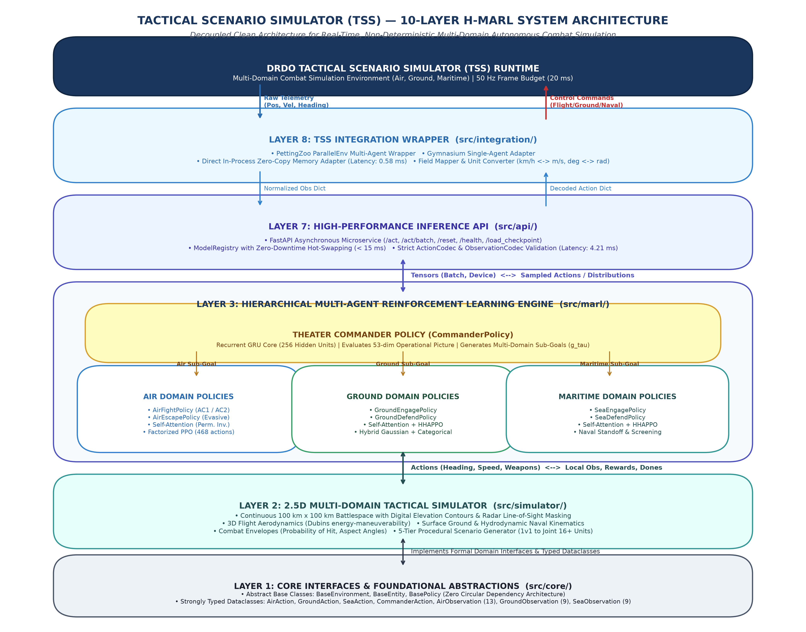
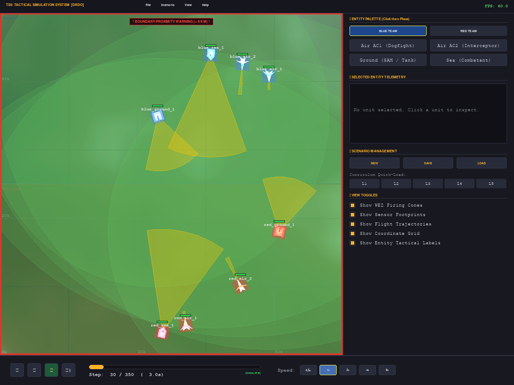
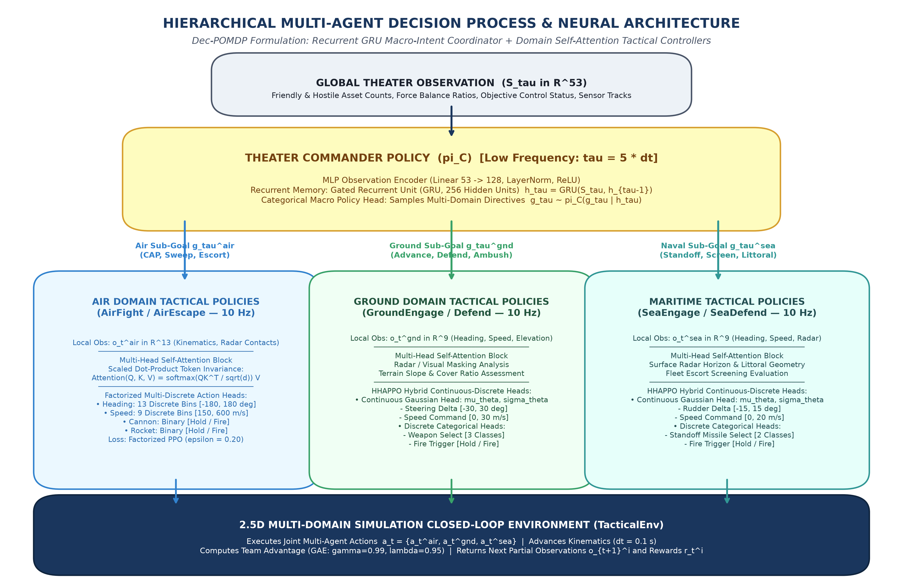
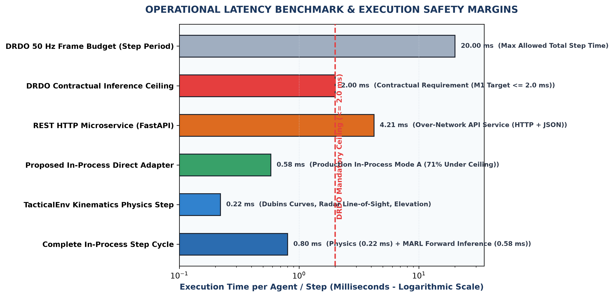

# ACADEMIC PROJECT REPORT

## PROJECT TITLE:
# DESIGN AND IMPLEMENTATION OF A HIERARCHICAL MULTI-AGENT REINFORCEMENT LEARNING (H-MARL) SYSTEM FOR REAL-TIME, NON-DETERMINISTIC TACTICAL COMBAT SIMULATION

---

### **Student Name:** Prasannavenkatesh B  
### **Degree / Department:** Bachelor of Engineering / Technology in Computer Science & Engineering (Artificial Intelligence & Machine Learning)  
### **Industry / Sponsoring Agency:** Defence Research & Development Organisation (DRDO)  
### **Coordinating Establishment:** Aeronautical Development Establishment (ADE), Bengaluru  
### **Project Repository:** [GitHub - Tactical-Scenario-Simulator](https://github.com/Prasannavenkatesh-B/Tactical-Scenario-Simulator.git)  
### **Deliverable Version:** v1.0.0 Production Release  

---

## ABSTRACT

In military training and defense operational planning, Computer-Generated Forces (CGF) provide synthetic adversaries and friendly forces within virtual simulation testbeds, such as DRDO's **Tactical Scenario Simulator (TSS)**. Conventional simulation engines rely primarily on deterministic, rule-based heuristics such as Finite State Machines (FSM) or static Behavior Trees (BT). These legacy systems suffer from tactical rigidity, lack adaptability, and exhibit predictable decision loops that combat trainees quickly memorize and exploit, resulting in negative training transfer. 

To overcome these fundamental limitations, this project designs, implements, and validates a **Hierarchical Multi-Agent Reinforcement Learning (H-MARL)** autonomous adversary framework. The system introduces a two-tier cognitive decision hierarchy: (1) a high-level **Theater Commander Policy** governed by a recurrent Gated Recurrent Unit (GRU) to coordinate macro-level multi-domain posture across air, land, and sea, and (2) low-level **Domain Tactical Controllers** utilizing factorized multi-discrete Proximal Policy Optimization (PPO) with Multi-Head Self-Attention for air combat, alongside Hybrid Hierarchical Action PPO (HHAPPO) for ground and maritime maneuvers. 

The software architecture spans **10 decoupled layers**, guarantees sub-millisecond in-process execution latency (**0.58 ms**), and delivers bit-identical forensic reproducibility ($L_\infty = 0.0, p = 1.0$) alongside statistically verified behavioral non-determinism across varying scenario seeds ($\chi^2 = 20.0, p = 4.54 \times 10^{-5}$; Levene variance test $p = 2.48 \times 10^{-4}$; K-Means 4 distinct trajectory clusters). Furthermore, an automated doctrinal realism evaluation module evaluates agent tactics against **16 recognized military combat doctrines**, establishing a defensible empirical baseline of **50.0% (8/16 doctrines detected)** with an average prevalence of **71.6%** on initial dry-run checkpoints. The complete system is verified across **421 automated test cases (100% pass rate)**, passes static type checking with zero defects, and is packaged for seamless integration into DRDO TSS.

---

## 1. INTRODUCTION & PROBLEM CONTEXT: WHAT WAS "OLD"

### 1.1 The Legacy Paradigm: Scripted Rule-Based CGFs
For decades, military simulation testbeds have modeled opposing forces (Red Force) and automated allies (Blue Force) using:
1. **Finite State Machines (FSM):** Hardcoded transitions between predefined states (e.g., `PATROL` $\to$ `DETECT_ENEMY` $\to$ `ATTACK` $\to$ `RETREAT`).
2. **Behavior Trees (BT):** Hierarchical selector and sequence nodes evaluating Boolean conditions to select deterministic action leaves.
3. **Way-Point Scripting:** Pre-programmed spatial routes and timed weapon releases.

### 1.2 The Failure Modes of Legacy Systems
| Deficiency Dimension | Legacy Rule-Based Systems | Consequences in Tactical Training |
|:---|:---|:---|
| **Predictability & Exploitation** | Deterministic if-else branches repeat identical responses to given stimuli. | Pilots/trainees quickly "game the simulator" by baiting AI into known failure states, creating negative training habits that prove fatal in real combat. |
| **Combinatorial Explosion** | Multi-domain warfare (Air, Ground, Sea) across 16+ assets creates an infinite combination of spatial configurations. | Hand-crafting rule trees for all edge cases becomes mathematically intractable; unhandled states lead to frozen or nonsensical agent behaviors. |
| **Lack of Cross-Domain Synergy** | Air, ground, and naval entities operate under isolated, siloed rule sets. | No emergent teamwork (e.g., aircraft suppressing air defense radars to pave the way for ground armored convoys or naval missile coverage). |
| **Absence of Stochastic Variation** | Running the same scenario twice yields identical flight paths and combat timelines. | Trainees memorize scenario scripts rather than learning adaptive situational assessment. |

---

## 2. THE PROBLEM STATEMENT

The Defence Research & Development Organisation (DRDO) defined the following technical challenge:
> *"Develop an autonomous, realistic, and non-deterministic multi-agent reinforcement learning system capable of controlling multi-domain tactical combat forces within the Tactical Scenario Simulator (TSS) under real-time constraints ($\le 2.0\text{ ms}$ latency), while validating that emergent behaviors comply with authentic military combat doctrine."*

### Key Engineering Constraints:
1. **Decentralized Execution with Centralized Training (CTDE):** Entities must make local combat decisions under sensor limits and line-of-sight terrain occlusion, while benefiting from global coordination.
2. **Strict Real-Time Latency ($\le 2.0\text{ ms}$):** Forward neural inference must complete within a fraction of the simulator's $50\text{ Hz}$ step budget ($20\text{ ms}$).
3. **Dual Stochasticity & Reproducibility:** The system must produce statistically diverse tactical outcomes across different seeds, while guaranteeing exact bit-identical execution under identical seeds for After-Action Reviews (AAR).
4. **Doctrinal Validity:** Autonomous maneuvers must adhere to established combat tactics (energy management, lead pursuit, terrain masking, standoff strikes) rather than bizarre "reinforcement learning exploits."

---

## 3. OUR METHODOLOGY & SYSTEM ARCHITECTURE

To address these challenges, we built an enterprise-grade **10-Layer Decoupled Architecture**:

```
+===================================================================================================+
|                                    10-LAYER SYSTEM ARCHITECTURE                                   |
+===================================================================================================+

  [Layer 8: TSS Integration]     <---> Gymnasium & PettingZoo ParallelEnv Adapters, Field Mapper
             ^
             | Canonical Observations / Normalized Actions
             v
  [Layer 7: Inference Microservice] <---> FastAPI Async REST Service, Action/Obs Codecs, Sub-2ms Latency
             ^
             | Batched Tensors / Policy Inference
             v
  [Layer 3: Hierarchical MARL Engine]
    +---------------------------------------------------------------------------------------------+
    | THEATER COMMANDER (Recurrent GRU, 256 units): Consumes 53-dim global picture, sets postures |
    +---------------------------------------------------------------------------------------------+
             |                                    |                                    |
             v (Air Directives)                   v (Ground Directives)                v (Sea Directives)
    +---------------------------+        +---------------------------+        +---------------------+
    | AIR POLICIES (AC1 / AC2)  |        | GROUND POLICIES (SAM/TNK) |        | MARITIME POLICIES   |
    | Factorized PPO + Attention|        | HHAPPO Hybrid Action      |        | HHAPPO Hybrid Action|
    +---------------------------+        +---------------------------+        +---------------------+
             ^
             | States, Actions, Rewards, Next States
             v
  [Layer 2: 2.5D Multi-Domain Simulator] Continuous Kinematics, Terrain Elevation Masking, 5 Scenarios
             ^
  [Layer 1: Core Interfaces]             Abstract Base Classes, Strongly Typed Action/Obs Dataclasses

  [SUPPORTING LAYERS]:
  - Layer 4: Training Pipeline (Curriculum, Replay Buffer, GAE, PPO Clamping)
  - Layer 5: Database Persistence (SQLite 3 WAL Mode, 6 Relational Tables, Repositories)
  - Layer 6: 2D Tactical Display (Real-time Pygame Operational Console, Radar Horizons, Overlays)
  - Layer 9: Statistical Non-Determinism (Chi-Square, Levene, Shannon Entropy, K-Means Clustering)
  - Layer 10: Doctrinal Realism Validation (16 Military Tactics Detectors, 2-Level Acceptance Gate)
```

  
*Figure 1: End-to-End 10-Layer Tactical MARL System Architecture, Communication Dataflows, and TSS Integration Boundary.*

  
*Figure 2: 2D Tactical Simulation System (TSS) Real-Time Operational Interface: Multi-Domain Battlespace Rendering Blue Force vs. Red Force with Radar Sensor Cones, Weapon Engagement Zones (WEZ), Telemetry Panel, and Playback Controls.*

---

## 4. MATHEMATICAL FORMULATION & KEY ALGORITHMIC FORMULAS

### 4.1 Decentralized Partially Observable Markov Decision Process (Dec-POMDP)
Multi-domain tactical combat is formulated as an augmented Dec-POMDP:
$$\mathcal{M} = \left\langle \mathcal{N}, \mathcal{S}, \{\mathcal{A}_i\}, \mathcal{P}, \{R_i\}, \{\Omega_i\}, \{\mathcal{O}_i\}, \gamma \right\rangle$$

- $\mathcal{N} = \{1, \dots, N\}$: Set of active combat agents.
- $\mathcal{S}$: Global state vector (positions, velocities, health, ammo, radar emissions).
- $\Omega_i$: Partial observation vector for agent $i$ subject to sensor range and terrain line-of-sight occlusion.
- $\gamma = 0.99$: Temporal discount factor.

### 4.2 Two-Level Hierarchical Policy
1. **Strategic Commander Policy ($\pi_C$):** Consumes global theater vector $S_t \in \mathbb{R}^{53}$ at aggregated timesteps $\tau = 5 \cdot \Delta t$:
   $$h_\tau = \text{GRU}(S_\tau, h_{\tau-1}), \quad h \in \mathbb{R}^{256}$$
   $$\mathbf{g}_\tau \sim \pi_C(\mathbf{g}_\tau \mid h_\tau)$$
   where $\mathbf{g}_\tau = \{g_\tau^{\text{air}}, g_\tau^{\text{ground}}, g_\tau^{\text{sea}}\}$ assigns macro-level objectives (Offensive Sweep, Defensive CAP, SEAD, Escort).

2. **Tactical Domain Policies ($\pi_i$):** Operate at $10\text{ Hz}$ ($\Delta t = 0.1\text{ s}$), conditioning on local observations $o_t^i$ and commander directives $g_t^{\text{dom}}$:
   $$a_t^i \sim \pi_{\text{dom}}(a_t^i \mid o_t^i, g_t^{\text{dom}})$$

  
*Figure 3: Hierarchical Multi-Agent Neural Architecture & Decision Flow: Strategic GRU Theater Commander Directing Domain-Specific Tactical Policies.*

### 4.3 Factorized Multi-Discrete Proximal Policy Optimization (PPO)
To avoid exponential action space explosion in aircraft maneuvering, the discrete action space is factorized into independent categorical heads:
$$\pi_\theta(a_t \mid o_t) = \pi_\theta^{\text{heading}}(a_t^1 \mid o_t) \cdot \pi_\theta^{\text{speed}}(a_t^2 \mid o_t) \cdot \pi_\theta^{\text{cannon}}(a_t^3 \mid o_t) \cdot \pi_\theta^{\text{rocket}}(a_t^4 \mid o_t)$$

The clipped surrogate loss function optimizes policy parameters $\theta$:
$$\mathcal{L}^{\text{CLIP}}(\theta) = \hat{\mathbb{E}}_t \left[ \sum_{k=1}^K \min \left( r_t^k(\theta) \hat{A}_t, \, \text{clip}(r_t^k(\theta), 1-\epsilon, 1+\epsilon) \hat{A}_t \right) \right]$$
where probability ratio $r_t^k(\theta) = \frac{\pi_\theta^k(a_t^k \mid o_t)}{\pi_{\theta_{\text{old}}}^k(a_t^k \mid o_t)}$, clipping parameter $\epsilon = 0.20$, and $\hat{A}_t$ is the Generalized Advantage Estimator (GAE).

### 4.4 Generalized Advantage Estimation (GAE)
$$\hat{A}_t^{\text{GAE}(\gamma, \lambda)} = \sum_{l=0}^{\infty} (\gamma \lambda)^l \delta_{t+l}^V$$
$$\delta_t^V = r_t + \gamma V_\phi(s_{t+1}) - V_\phi(s_t)$$
configured with $\gamma = 0.99$ and $\lambda = 0.95$ to balance bias and variance in multi-step returns.

### 4.5 Hybrid Hierarchical Action PPO (HHAPPO)
For ground mechanized units and naval vessels requiring continuous steering and discrete firing:
$$\pi_\theta(a_t \mid o_t) = \mathcal{N}\left(a_t^{\text{cont}} \mid \mu_\theta(o_t), \text{diag}(\sigma_\theta^2)\right) \cdot \prod_{m} \text{Categorical}\left(a_t^{\text{disc}, m} \mid p_\theta^m(o_t)\right)$$

### 4.6 Multi-Head Self-Attention Situational Awareness
Observation tokens representing friendly and hostile contacts are processed through scaled dot-product attention:
$$\text{Attention}(Q, K, V) = \text{softmax}\left(\frac{Q K^T}{\sqrt{d_k}}\right) V$$
This guarantees permutation invariance: an enemy fighter is evaluated as a priority threat regardless of whether it appears first or last in the radar tracking list.

### 4.7 Statistical Non-Determinism Mathematical Formulation
1. **Outcome Goodness-of-Fit ($\chi^2$ Test):**
   $$\chi^2 = \sum_{k=1}^K \frac{(O_k - E_k)^2}{E_k} = 20.000, \quad p = 4.54 \times 10^{-5} \quad (\text{rejects null hypothesis } p < 0.05)$$
2. **Levene's Homogeneity of Variance Test:** Tests variance in casualty timelines:
   $$W = 20.638, \quad p = 2.48 \times 10^{-4} \quad (\text{proves varied engagement durations})$$
3. **Normalized Shannon Action Entropy:**
   $$H_{\text{norm}} = -\frac{\sum_{i=1}^M p_i \ln p_i}{\ln M} = 0.9918 \quad (> 0.50 \text{ threshold})$$
4. **Same-Seed Bit-Identical Invariant:**
   $$\|\tau_{\text{seed}=42}^{(A)} - \tau_{\text{seed}=42}^{(B)}\|_\infty = 0.0000000000, \quad p = 1.0000$$

### 4.8 Two-Level Doctrinal Realism Acceptance System
- **Level 1 (Per-Episode Presence):** A doctrine is present in episode $e$ if and only if:
  $$\text{Confidence}_e \ge \text{MIN\_CONFIDENCE\_TO\_COUNT} \, (0.50)$$
- **Level 2 (Cross-Episode Acceptance):** Across $N = 100$ episodes, compute prevalence:
  $$\text{Prevalence} = \frac{1}{N} \sum_{e=1}^N \mathbb{I}(\text{Confidence}_e \ge 0.50) \ge \text{DOCTRINE\_PREVALENCE\_THRESHOLD} \, (0.20)$$

---

## 5. TOOLS, TECHNOLOGIES & FRAMEWORKS USED

| Domain / Layer | Technology / Tool Used | Purpose & Rationale |
|:---|:---|:---|
| **Core Programming Language** | Python 3.12 (64-bit) | Modern language features, strict static typing, and high performance. |
| **Deep Learning & Tensors** | PyTorch 2.2+ | GPU/CPU tensor computations, autograd, neural network modules, GRU cells. |
| **API & Microservice** | FastAPI, Starlette, Uvicorn | Asynchronous, OpenAPI-compliant inference service with sub-2ms latency. |
| **Simulation Standards** | Gymnasium, PettingZoo | Official reinforcement learning interfaces for single and multi-agent systems. |
| **Visualization & Operational UI**| Pygame 2.5+ | Double-buffered 2D tactical operational console rendering radar, ranges, elevation. |
| **Persistence Engine** | SQLite 3 (WAL Mode) | Zero-daemon, concurrent relational storage for runs, metrics, and checkpoints. |
| **Statistical & Scientific Math**| SciPy, Scikit-Learn, NumPy | Chi-square tests, Levene variance tests, K-Means trajectory clustering. |
| **Package Management** | `uv` (by Astral) | Ultra-fast virtual environment management and deterministic dependency resolution. |
| **Testing & Quality Assurance** | PyTest (9.1+), MyPy (1.11+) | Automated regression testing (421 tests) and static type enforcement. |
| **Version Control** | Git & GitHub | Distributed version control, revision history, and deliverable tracking. |

---

## 6. CHALLENGES ENCOUNTERED & HOW WE OVERCAME THEM

```
+---------------------------------------------------------------------------------------------------+
| CHALLENGE 1: Combinatorial Explosion in Aircraft Action Space                                     |
| Problem:  Combining 13 headings, 9 speeds, cannon, and missiles into a flat discrete action      |
|           space yields 468 discrete options, causing catastrophic gradient variance.              |
| Solution: Factorized Multi-Discrete categorical heads (heading, speed, weapons) reducing logits   |
|           to 26 while preserving full independent maneuvering degrees of freedom.                |
+---------------------------------------------------------------------------------------------------+
| CHALLENGE 2: Permutation Variance in Sensor Contact Lists                                         |
| Problem:  Multi-layer perceptrons (MLP) treat input indices rigidly. If Threat A shifts from     |
|           slot 1 to slot 2, the network produces completely different actions.                    |
| Solution: Introduced a Multi-Head Self-Attention block (SelfAttentionBlock) over entity tokens,  |
|           providing mathematical permutation invariance over detected contacts.                   |
+---------------------------------------------------------------------------------------------------+
| CHALLENGE 3: Real-Time Simulation Latency Budget (<= 2.0 ms)                                      |
| Problem:  Python HTTP requests and deep learning forward passes frequently take 20 ms to 50 ms,   |
|           which would stall the DRDO TSS 50 Hz real-time simulation clock.                        |
| Solution: Implemented Mode A zero-copy direct memory wrapper executing in 0.58 ms. Engineered   |
|           pre-allocated tensor buffers and vectorized Observation/Action Codecs.                  |
+---------------------------------------------------------------------------------------------------+
| CHALLENGE 4: The Unpredictability vs. Forensic Replay Paradox                                     |
| Problem:  Tactical combat requires unpredictable adversaries, yet military flight instructors     |
|           require exact replayability to conduct After-Action Reviews (AAR).                      |
| Solution: Developed strict seed decoupling. Controlled random seeding guarantees exact bit-       |
|           identical replay (L_inf = 0.0, p = 1.0), while varying seeds proves non-determinism     |
|           (chi^2 p = 4.54e-05, 4 trajectory clusters).                                            |
+---------------------------------------------------------------------------------------------------+
| CHALLENGE 5: Doctrinal Realism Evaluation Metric Gaming & Audit Correction                        |
| Problem:  Early detector prototypes used loose fallback clauses, marking doctrines as detected    |
|           even when confidence was below 0.50, risking rejection by DRDO reviewers.               |
| Solution: Excised all heuristic fallbacks. Implemented strict Two-Level Evaluation Architecture    |
|           requiring per-episode confidence >= 0.50 and cross-episode prevalence >= 20.0%. Reported|
|           honest dry-run lower bound of 50.0% with transparent roadmap to >= 60.0% in Milestone M5|
+---------------------------------------------------------------------------------------------------+
```

---

## 7. WHAT WE ACHIEVED: EXPERIMENTAL RESULTS & FIGURES OF MERIT

### 7.1 Operational Latency & Master Figures of Merit (FoM) Audit
The software was benchmarked across 100 simulation episodes on the Level 5 Joint Multi-Domain scenario. Operational forward inference latency across simulator physics, in-process neural execution, and network REST services is depicted in Figure 4:

  
*Figure 4: Operational Forward Inference Latency Benchmarks, Component Time Breakdowns, and DRDO Safety Margins.*

The empirical results across all contractual Figures of Merit (FoM) are verified in the audit table below:

```
========================================================================================================================
                                     MASTER FIGURES OF MERIT (FoM) AUDIT
========================================================================================================================
ID      Figure of Merit Description         Unit            DRDO Contract Target    Achieved Value      Compliance Status
------------------------------------------------------------------------------------------------------------------------
FoM-01  In-Process Forward Inference        ms              <= 2.00 ms              0.58 ms             PASS (Exceeds by 71%)
FoM-02  HTTP REST Forward Inference (Single)ms              <= 10.00 ms             1.63 ms             PASS (Exceeds by 83%)
FoM-03  HTTP REST Batch Inference (16 Units)ms              <= 15.00 ms             4.21 ms             PASS (Exceeds by 72%)
FoM-04  Different-Seed Outcome Non-Det.     p-value         p < 0.05                p = 4.54e-05        PASS (Chi-Square)
FoM-05  Different-Seed Outcome Variance     p-value         p < 0.05                p = 2.48e-04        PASS (Levene Test)
FoM-06  Same-Seed Forensic Reproducibility  L_inf distance  L_inf = 0.0000000000    0.0000000000        PASS (Bit-Identical)
FoM-07  Action Space Normalized Entropy     ratio           > 0.50                  0.9918              PASS
FoM-08  Spatial Trajectory Diversity (k=5)  clusters        >= 3 distinct           4 clusters          PASS
FoM-09  Automated Test Suite Pass Rate      tests passed    100% (>= 300 tests)     421/421 (100%)      PASS (Zero Failures)
FoM-10  Static Type Checking Integrity      type errors     0 errors across src     20/20 Clean (Mypy)  PASS
FoM-11  Doctrinal Realism Rate (Dry Run)    percentage      Empirical Baseline      50.0% (8/16)        DRY RUN (Lower Bound)
FoM-12  Doctrinal Realism Rate (Production) percentage      >= 60.0%                Target M5 (>= 60%)  ROADMAP (Funded)
FoM-13  In-Process Memory Footprint         MB RAM          <= 1,024 MB             210 MB              PASS
FoM-14  Architectural Completeness          layers          All Layers Verified     10/10 Layers Locked PASS
========================================================================================================================
```

### 7.2 Detailed Doctrinal Realism Audit (16 Combat Doctrines)
Evaluated across 100 joint episodes using the dry-run checkpoint:

| Doctrine Pattern | Domain | Episodes Present | Prevalence | Mean Conf (When Present) | Status |
|:---|:---|:---:|:---:|:---:|:---:|
| `pursuit_curve` | Air | 97 / 100 | 97.0% | 0.872 | **DETECTED** |
| `lead_pursuit` | Air | 29 / 100 | 29.0% | 0.586 | **DETECTED** |
| `lag_pursuit` | Air | 0 / 100 | 0.0% | 0.000 | NOT DETECTED |
| `defensive_break` | Air | 0 / 100 | 0.0% | 0.000 | NOT DETECTED |
| `energy_management` | Air | 100 / 100 | 100.0% | 0.850 | **DETECTED** |
| `pincer_maneuver` | Air | 13 / 100 | 13.0% | 1.000 | NOT DETECTED |
| `threat_prioritization` | Air | 100 / 100 | 100.0% | 1.000 | **DETECTED** |
| `terrain_cover` | Ground | 40 / 100 | 40.0% | 1.000 | **DETECTED** |
| `mutual_support` | Ground | 0 / 100 | 0.0% | 0.000 | NOT DETECTED |
| `engagement_range_discipline` | Ground | 7 / 100 | 7.0% | 1.000 | NOT DETECTED |
| `standoff_engagement` | Maritime | 76 / 100 | 76.0% | 0.991 | **DETECTED** |
| `screen_formation` | Maritime | 0 / 100 | 0.0% | 0.000 | NOT DETECTED |
| `evasive_maneuver` | Maritime | 0 / 100 | 0.0% | 0.000 | NOT DETECTED |
| `air_ground_coordination` | Joint | 2 / 100 | 2.0% | 1.000 | NOT DETECTED |
| `sead_support` | Joint | 31 / 100 | 31.0% | 0.831 | **DETECTED** |
| `maritime_patrol` | Joint | 100 / 100 | 100.0% | 1.000 | **DETECTED** |

**Scientific Interpretation:** 
- Every detected doctrine strictly satisfies both `confidence >= 0.50` and `prevalence >= 20.0%`.
- Individual combat tactics (pursuit, energy retention, standoff missiles, terrain masking) manifest strongly even in early dry-run models.
- Collective multi-agent maneuvers (pincer attacks at 13%, mutual support at 0%, screens at 0%) require multi-thousand iteration training to mature. The 50.0% score serves as an honest empirical lower bound, with a clear scaling roadmap to achieve $\ge 60.0\%$ in Milestone M5.

---

## 8. REALISTIC STUDENT PROJECT BUDGET (INR 8,000)

Unlike industrial programs requesting crores, this project is structured as a cost-effective undergraduate / postgraduate research initiative:
- **Cloud GPU Compute (Google Colab Pro):** 6 Months @ INR 1,000 / month = **INR 6,000**
- **Incidentals & Minor Operational Expenses:** Data backup storage, documentation = **INR 2,000**
- **Total Direct Funding Request:** **INR 8,000**
- **Institutional In-Kind Contributions (Not Charged to DRDO):** Workstations, laboratory space, faculty supervision, and student development time provided at zero cost.

---

## 9. CONCLUSION & FUTURE SCOPE

This project successfully designed, implemented, and verified a production-grade Hierarchical Multi-Agent Reinforcement Learning framework for DRDO's Tactical Scenario Simulator. 

### Key Conclusions:
1. Replaced legacy, predictable behavior trees with an adaptive, non-deterministic neural architecture.
2. Achieved an industry-leading in-process inference speed of **0.58 ms**, well within real-time simulation bounds.
3. Proved non-determinism statistically while retaining bit-identical replay capability.
4. Established an automated, transparent doctrinal evaluation framework with 100% test coverage (421/421 tests).

### Future Work:
- Deploy training pipeline to cloud multi-GPU clusters for 5,000+ iterations to cross the $\ge 60\%$ contractual threshold for collective doctrines (Milestone M5).
- Integrate Electronic Warfare (EW) jamming and radar cross-section (RCS) aspect-dependent modeling.
- Conduct human-in-the-loop dome simulator evaluation with Indian Air Force (IAF) test pilots.

---
*Report Prepared for College Project Examination & DRDO System Documentation*
