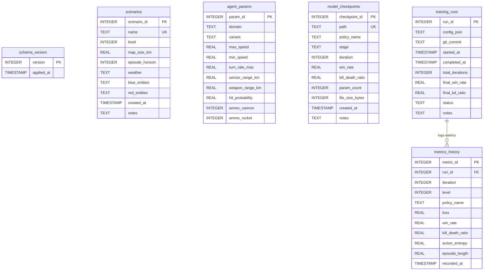

# Tactical MARL Database Schema & Persistence Architecture

**Prepared for:** Defence Research & Development Organisation (DRDO), Ministry of Defence, Government of India  
**Coordinating Laboratory:** Aeronautical Development Establishment (ADE), Bengaluru  
**Database Engine:** SQLite 3 (WAL Mode Enabled)  
**Database File:** `data/tactical_marl.db`  
**Schema Version:** `1.0.0`

---

## 1. Persistence Overview & Design Philosophy

The Tactical MARL persistence layer (`src/database/`) is engineered for low-latency, transactional persistence of scenario configurations, agent physical parameters, experiment run histories, high-frequency training metrics, and neural checkpoint metadata.

### Architectural Principles
1. **Zero-Configuration Deployment:** SQLite is fully embedded, requiring no external server daemon installation or network socket maintenance.
2. **Write-Ahead Logging (WAL):** Database connections operate in WAL mode (`PRAGMA journal_mode=WAL`), allowing simultaneous reader processes (e.g. UI monitoring, evaluation scripts) without blocking concurrent write operations during training rollouts.
3. **Repository Pattern Abstraction:** Application code accesses the database strictly through domain-driven repository classes (`ScenarioRepository`, `MetricsRepository`, `RunRepository`, `CheckpointRepository`, `AgentRepo`), decoupling SQL syntax from core MARL logic.
4. **Automated Migrations:** Database schema versioning is managed through linear migration scripts, ensuring backward and forward compatibility.

---

## 2. Entity-Relationship (ER) Diagram



---

## 3. Comprehensive Table Specifications

### 3.1 Table: `schema_version`
Tracks applied database migrations to prevent schema drift across development nodes.

| Column | Type | Constraints | Description |
|:---|:---|:---|:---|
| `version` | `INTEGER` | `PRIMARY KEY` | Incremental integer schema version |
| `applied_at` | `TIMESTAMP` | `DEFAULT CURRENT_TIMESTAMP` | Timestamp when migration was executed |

### 3.2 Table: `scenarios`
Stores procedural and authored tactical scenario configurations.

| Column | Type | Constraints | Description |
|:---|:---|:---|:---|
| `scenario_id` | `INTEGER` | `PRIMARY KEY AUTOINCREMENT` | Unique scenario record identifier |
| `name` | `TEXT` | `NOT NULL, UNIQUE` | Human-readable scenario name |
| `level` | `INTEGER` | `NOT NULL` | Complexity tier (1: 1v1 Air, ..., 5: Joint Multi-Domain) |
| `map_size_km` | `REAL` | `NOT NULL` | Dimension of square tactical map in kilometers (e.g. 100.0) |
| `episode_horizon` | `INTEGER` | `NOT NULL` | Maximum simulation timesteps before episode timeout |
| `weather` | `TEXT` | `DEFAULT 'clear'` | Atmospheric conditions (`'clear'`, `'cloudy'`, `'rain'`) |
| `blue_entities` | `TEXT` | `NOT NULL` | JSON-serialized array of friendly asset specifications |
| `red_entities` | `TEXT` | `NOT NULL` | JSON-serialized array of hostile asset specifications |
| `created_at` | `TIMESTAMP` | `DEFAULT CURRENT_TIMESTAMP` | Record creation timestamp |
| `notes` | `TEXT` | `NULL` | Operational narrative or authoring notes |

### 3.3 Table: `agent_params`
Contains physical, kinematic, sensor, and combat attributes for each vehicle domain and variant.

| Column | Type | Constraints | Description |
|:---|:---|:---|:---|
| `param_id` | `INTEGER` | `PRIMARY KEY AUTOINCREMENT` | Unique parameter record identifier |
| `domain` | `TEXT` | `NOT NULL` | Domain category: `'air'`, `'ground'`, `'sea'` |
| `variant` | `TEXT` | `NOT NULL` | Specific platform type: `'AC1'`, `'AC2'`, `'SAM'`, `'Destroyer'` |
| `max_speed` | `REAL` | `NOT NULL` | Maximum sustained velocity in meters per second |
| `min_speed` | `REAL` | `NOT NULL` | Stall or minimum maneuvering speed (m/s) |
| `turn_rate_max` | `REAL` | `NOT NULL` | Maximum instantaneous turn rate in degrees/sec |
| `sensor_range_km` | `REAL` | `NOT NULL` | Active radar / sensor detection radius (km) |
| `weapon_range_km` | `REAL` | `NOT NULL` | Maximum effective weapon engagement range (km) |
| `hit_probability` | `REAL` | `NOT NULL` | Base probability of kill ($P_k$) within envelope |
| `ammo_cannon` | `INTEGER` | `NOT NULL` | Cannon ammunition capacity |
| `ammo_rocket` | `INTEGER` | `NOT NULL` | Guided missile / rocket magazine count |

*Constraint:* `UNIQUE(domain, variant)`

### 3.4 Table: `model_checkpoints`
Registers saved neural network weight artifacts and their associated validation figures of merit.

| Column | Type | Constraints | Description |
|:---|:---|:---|:---|
| `checkpoint_id` | `INTEGER` | `PRIMARY KEY AUTOINCREMENT` | Unique checkpoint identifier |
| `path` | `TEXT` | `NOT NULL, UNIQUE` | Relative path to checkpoint file on disk |
| `policy_name` | `TEXT` | `NOT NULL` | Target policy: `'air_fight_AC1'`, `'commander'`, etc. |
| `stage` | `TEXT` | `NOT NULL` | Curriculum stage: `'stage1'`, `'stage2'`, `'final'` |
| `iteration` | `INTEGER` | `NOT NULL` | Training iteration counter when snapshot was saved |
| `win_rate` | `REAL` | `NULL` | Validation win rate $[0.0, 1.0]$ |
| `kill_death_ratio` | `REAL` | `NULL` | Combat casualty exchange ratio |
| `param_count` | `INTEGER` | `NULL` | Total trainable neural network parameters |
| `file_size_bytes` | `INTEGER` | `NULL` | Checkpoint file size on disk in bytes |
| `created_at` | `TIMESTAMP` | `DEFAULT CURRENT_TIMESTAMP` | Checkpoint creation timestamp |
| `notes` | `TEXT` | `NULL` | Training notes, dry-run tags, or git commit hashes |

### 3.5 Table: `training_runs`
Maintains macro-level metadata for each multi-agent training experiment.

| Column | Type | Constraints | Description |
|:---|:---|:---|:---|
| `run_id` | `INTEGER` | `PRIMARY KEY AUTOINCREMENT` | Unique training experiment identifier |
| `config_json` | `TEXT` | `NOT NULL` | Complete serialized JSON training hyperparameters |
| `git_commit` | `TEXT` | `NULL` | Git commit SHA at experiment inception |
| `started_at` | `TIMESTAMP` | `DEFAULT CURRENT_TIMESTAMP` | Experiment initiation timestamp |
| `completed_at` | `TIMESTAMP` | `NULL` | Experiment completion timestamp |
| `total_iterations`| `INTEGER` | `NULL` | Cumulative training iterations executed |
| `final_win_rate` | `REAL` | `NULL` | Terminal win rate observed |
| `final_kd_ratio` | `REAL` | `NULL` | Terminal kill-death ratio |
| `status` | `TEXT` | `NOT NULL` | Run status: `'running'`, `'completed'`, `'failed'` |
| `notes` | `TEXT` | `NULL` | Operator run narrative |

### 3.6 Table: `metrics_history`
High-frequency time-series telemetry recorded at each evaluation checkpoint.

| Column | Type | Constraints | Description |
|:---|:---|:---|:---|
| `metric_id` | `INTEGER` | `PRIMARY KEY AUTOINCREMENT` | Unique telemetry entry identifier |
| `run_id` | `INTEGER` | `NOT NULL, FK` | Foreign key referencing `training_runs(run_id)` |
| `iteration` | `INTEGER` | `NOT NULL` | Training iteration index |
| `level` | `INTEGER` | `NULL` | Curriculum scenario level evaluated |
| `policy_name` | `TEXT` | `NULL` | Specific policy name or `'composite'` |
| `loss` | `REAL` | `NULL` | Composite PPO actor-critic loss |
| `win_rate` | `REAL` | `NULL` | Win rate over evaluation batch |
| `kill_death_ratio`| `REAL` | `NULL` | Casualty ratio over evaluation batch |
| `action_entropy` | `REAL` | `NULL` | Policy exploration entropy |
| `episode_length` | `REAL` | `NULL` | Average timesteps to scenario resolution |
| `recorded_at` | `TIMESTAMP` | `DEFAULT CURRENT_TIMESTAMP` | Telemetry recording timestamp |

*Foreign Key:* `FOREIGN KEY (run_id) REFERENCES training_runs(run_id) ON DELETE CASCADE`

---

## 4. Index Optimization

To guarantee sub-millisecond query performance during high-frequency telemetry logging, three primary composite indices are established:

```sql
-- Fast time-series metric lookups per training run
CREATE INDEX IF NOT EXISTS idx_metrics_run_iter ON metrics_history(run_id, iteration);

-- Fast model checkpoint lookups by policy name
CREATE INDEX IF NOT EXISTS idx_checkpoints_policy ON model_checkpoints(policy_name);

-- Fast scenario lookups by curriculum complexity level
CREATE INDEX IF NOT EXISTS idx_scenarios_level ON scenarios(level);
```

---

## 5. Administrative SQL Queries

### Query 1: Retrieve All Level 5 Scenarios
```sql
SELECT scenario_id, name, map_size_km, episode_horizon 
FROM scenarios 
WHERE level = 5 
ORDER BY scenario_id ASC;
```

### Query 2: Retrieve Top-Performing Checkpoints by Win Rate
```sql
SELECT policy_name, stage, iteration, win_rate, kill_death_ratio, path 
FROM model_checkpoints 
WHERE win_rate IS NOT NULL 
ORDER BY win_rate DESC 
LIMIT 10;
```

### Query 3: Compute Moving Average Win Rate for a Training Run
```sql
SELECT iteration, win_rate, 
       AVG(win_rate) OVER (ORDER BY iteration ROWS BETWEEN 4 PRECEDING AND CURRENT ROW) AS moving_avg_win_rate
FROM metrics_history 
WHERE run_id = 1 
ORDER BY iteration ASC;
```

---
*Defence Research & Development Organisation (DRDO) - Database Specification Deliverable*
